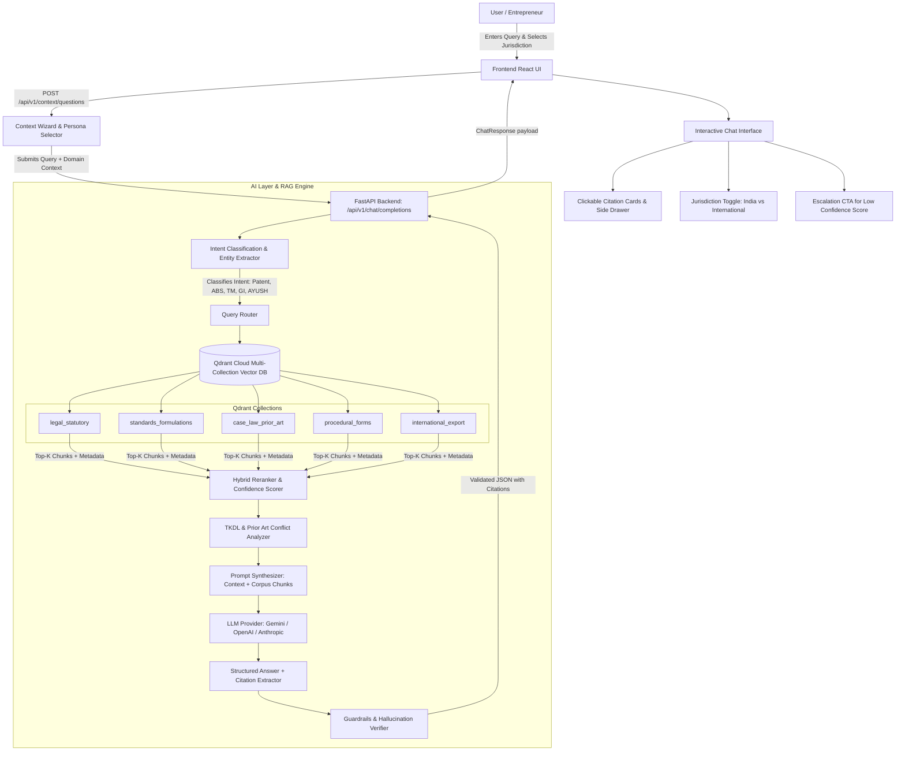

# IP-SAKTI Sahayak

**SIH 2026 — Problem Statement 26045 (Ministry of Ayush / All India Institute of Ayurveda)**

A multilingual, RAG-based, source-cited AI assistant for Intellectual Property and
regulatory guidance in Ayurveda, across national and international regimes.

> ⚠️ This is not an Ayurveda chatbot. It is an AI-powered IP + regulatory
> decision-support system whose answers are generated from authoritative
> legal/regulatory sources and are traceable to those sources. It provides
> **information, not legal advice**.

---

## 0. Read this first if you are an AI agent

If you are an AI coding assistant picking up this project (in any session, any tool),
**read these three files in the repo root, in order, before writing any code**:

1. `context.md` — what this project is, why it's built this way, and the decisions
   already made (so you don't re-litigate them).
2. `process.md` — what has been done, what is in progress, and what to do next.
3. The `coding_conventions.md` inside whichever folder you're working in
   (`frontend/`, `backend/`, or `ai/`).

Then open `prompts/` inside your assigned folder and find the next un-checked task
for the current phase. Each task in that file is a self-contained prompt — treat it
as your instructions. When you finish a task, **update `process.md` and the
`status.md` in your folder** before ending your turn (see the update template in
`process.md`).

---

## 1. What this project actually is

A product entrepreneur (e.g. "turmeric + ashwagandha + giloy formulation for
immunity") has questions like:

- Can I patent this?
- Is it already traditional knowledge?
- Do I need ABS (Access and Benefit Sharing) approval?
- Is it an Ayurvedic medicine or Ayurveda-Aahara (food)?
- Can I register the brand name / protect the packaging?
- Can I export it, and what changes internationally?

Today answering this requires consulting many different statutes, registries and
often a lawyer. IP-SAKTI Sahayak brings this together into one system that:

- **Classifies the product first** (classical medicine / proprietary medicine / new
  drug / phytopharmaceutical / Ayurveda-Aahara / cosmetic) — because IP strategy
  depends entirely on this.
- **Routes the question** across IP types (Patent, GI, Trademark, Copyright, Design,
  Plant Variety, Trade Secret), ABS/TKDL, and drug/food/cosmetic regulation.
- **Keeps India and International answers visibly separate** via an explicit
  jurisdiction toggle — never conflated.
- **Never answers without evidence.** Every material claim is retrieved from a
  version-tracked corpus of statutes/rules/treaties/registry data, cited, and
  validated before being shown to the user.
- **Escalates to a human IP facilitator** when confidence is low.

## 2. Architecture — three parts

```
 USER
   │
   ▼
 FRONTEND (React)  ──calls──▶  BACKEND (FastAPI)  ──calls──▶  AI LAYER (RAG pipeline)
   │                               │                               │
 chat UI, classification        auth, persistence,           retrieval, classification
 wizard, jurisdiction toggle,   document mgmt, audit log,     rules, LLM reasoning,
 citation cards, dashboards     API contracts                 citation validation
```

We build it as a **modular monolith first**, not microservices — three cleanly
separated codebases (`frontend/`, `backend/`, `ai/`) that talk over well-defined HTTP
contracts. This is far easier to build, debug and demo for SIH than a distributed
system, and can be split into services later if needed.

Full stack decisions and rationale live in `context.md`. Each folder's
`coding_conventions.md` has the authoritative, current dependency list — check there
before assuming a library choice from this README is still current.

## 3. Prerequisites (manual, one-time, human setup)

These cannot be done by an AI agent — a human needs to do these before development
starts:

| # | What | Why | Where to get it |
|---|---|---|---|
| 1 | Node.js 20+ and npm/pnpm | Frontend | nodejs.org |
| 2 | Python 3.11+ | Backend + AI layer | python.org |
| 3 | Docker + Docker Compose | Postgres, Redis, local dev stack | docker.com |
| 4 | An LLM API key (Anthropic **or** OpenAI **or** Google) | AI reasoning layer | console.anthropic.com / platform.openai.com / ai.google.dev |
| 5 | (Optional, Phase 2+) Bhashini API access | Hindi voice/translation | bhashini.gov.in — request API access as a developer |
| 6 | (Optional, Phase 2+) Object storage — AWS S3 credentials, or run MinIO locally via Docker (no signup needed for local dev) | storing original source PDFs | aws.amazon.com/s3 |
| 7 | GitHub repo + a place to push (for CI/CD later) | version control | github.com |
| 8 | Free hosting/deploy accounts when ready: Vercel (frontend), Render/Railway (backend) | demo deployment | vercel.com, render.com |

Do **not** wait on #5/#6/#8 to start Phase 1 work — they're only needed from the
phase noted in each folder's `prompts.md`.

## 4. Repository layout

```
/
├── README.md                  ← you are here
├── context.md                 ← project context, read first
├── process.md                 ← live status tracker, read second
├── frontend/
│   ├── coding_conventions.md
│   ├── status.md
│   └── prompts/
│       └── phases.md
├── backend/
│   ├── coding_conventions.md
│   ├── status.md
│   └── prompts/
│       └── phases.md
└── ai/
    ├── coding_conventions.md
    ├── status.md
    └── prompts/
        └── phases.md
```

(The actual application source code — `frontend/src`, `backend/app`, `ai/` pipeline
code — gets created *inside* these same folders as Phase 1 tasks are executed. These
docs live alongside the code, not in a separate `docs/` tree, so an agent working in
`backend/` always has its conventions one directory away.)

## 5. Local Setup & Running the Project

Follow these steps to run the complete stack locally (Backend, AI Pipeline, and Frontend).

### Prerequisites
- **Node.js**: v20+ and `npm`
- **Python**: v3.11+ (recommended v3.11 or v3.12)
- **API Keys**:
  - `LLM_API_KEY`: Google Gemini API Key (`gemini-2.0-flash` / `gemini-1.5-pro`) or OpenAI / Anthropic key
  - `QDRANT_URL` & `QDRANT_API_KEY`: Qdrant Cloud cluster or local Qdrant instance

---

### Step 1: Backend Setup (FastAPI)

1. Open a terminal and navigate to `backend/`:
   ```bash
   cd backend
   ```

2. Create and activate a Python virtual environment:
   ```bash
   # Windows (PowerShell)
   python -m venv .venv
   .\.venv\Scripts\Activate.ps1

   # Linux / macOS
   python3 -m venv .venv
   source .venv/bin/activate
   ```

3. Install backend dependencies:
   ```bash
   pip install -r requirements.txt
   ```

4. Create your `.env` file from the example:
   ```bash
   cp .env.example .env
   ```
   *Fill in your `LLM_API_KEY`, `JWT_SECRET` (generate with `python -c "import secrets; print(secrets.token_hex(32))"`), `QDRANT_URL`, `QDRANT_API_KEY`, and database credentials.* (If `DATABASE_URL` is omitted, the app will run with SQLite fallback for local testing).

5. Apply database migrations:
   ```bash
   alembic upgrade head
   ```

6. Start the FastAPI backend server:
   ```bash
   uvicorn app.main:app --reload --port 8000
   ```
   *The backend API documentation will be available at `http://localhost:8000/docs`.*

---

### Step 2: AI Layer & Knowledge Corpus Ingestion

1. Navigate to the `ai/` directory:
   ```bash
   cd ../ai
   ```

2. (Optional, if using separate venv) Install AI pipeline dependencies:
   ```bash
   pip install -r requirements.txt
   ```

3. Configure `ai/.env`:
   ```env
   LLM_API_KEY=your_gemini_or_openai_key
   QDRANT_URL=your_qdrant_cloud_url
   QDRANT_API_KEY=your_qdrant_api_key
   EMBEDDING_PROVIDER=sentence-transformers/all-MiniLM-L6-v2
   ```

4. Ingest and index the authoritative IP & Ayurveda knowledge corpus into Qdrant collections (`legal_statutory`, `standards_formulations`, `case_law_prior_art`, `procedural_forms`, `international_export`):
   ```bash
   python src/ingestion/ingest_corpus.py
   ```

5. Verify vector retrieval:
   ```bash
   python scratch/verify_retrieval.py
   ```

---

### Step 3: Frontend Setup (React + Vite + Tailwind CSS)

1. Open a new terminal and navigate to `frontend/`:
   ```bash
   cd frontend
   ```

2. Install npm dependencies:
   ```bash
   npm install
   ```

3. Configure environment variables:
   ```bash
   cp .env.example .env
   ```
   *Ensure `VITE_API_BASE_URL=http://localhost:8000` is set.*

4. Start the Vite development server:
   ```bash
   npm run dev
   ```
   *Access the web app at `http://localhost:5173`.*

---

### Step 4: Running Automated Tests

- **Backend tests**:
  ```bash
  cd backend && pytest
  ```
- **AI tests**:
  ```bash
  cd ai && pytest
  ```
- **Frontend unit tests**:
  ```bash
  cd frontend && npm test
  ```

---

## 6. Full End-to-End Workflow with RAG Pipeline

The diagram and steps below describe how a user query travels through the application—from intent classification and multi-collection vector search to grounded answer synthesis with traceable legal citations.

### Architectural RAG Workflow Diagram



### Detailed Step-by-Step RAG Execution Flow

1. **User Interaction & Context Elicitation**:
   - The user inputs a query (e.g., *"Can I patent a topical cream combining Curcumin, Neem, and Aloe Vera for eczema in India and the US?"*).
   - The frontend allows selecting user persona (Startup, Researcher, MSME, Legal Counsel) and jurisdiction scope (**India**, **International / PCT**, or **Both**).
   - If the intent requires specific product classification, the system dynamically gathers required attributes (e.g. classical citation vs proprietary formulation, extraction method, ABS bio-resource origin).

2. **Intent Classification & Routing (`ai/src/classification/`)**:
   - The query is analyzed by the intent classifier to identify relevant IP domains: **Patentability**, **Traditional Knowledge (TKDL / Section 3(p))**, **Biological Diversity Act (ABS)**, **Ayurveda-Aahara vs Drug licensing**, **Trademark / GI**, and **Export compliance**.

3. **Hybrid Vector & Keyword Retrieval (`ai/src/retrieval/` & `ai/src/embeddings/`)**:
   - Dense embeddings are generated using domain-tuned embedding models (`sentence-transformers/all-MiniLM-L6-v2` or `text-embedding-3-small`).
   - Targeted queries are executed across segmented Qdrant vector collections:
     - `legal_statutory`: Indian Patents Act 1970, Biological Diversity Act 2002, Drugs & Cosmetics Act 1940, FSSAI regulations.
     - `standards_formulations`: Ayurvedic Pharmacopoeia of India (API), Ayurvedic Formulary of India (AFI), classical texts.
     - `case_law_prior_art`: Landmark IPAB, High Court, and EPO/USPTO traditional knowledge patent challenges.
     - `procedural_forms`: Form 1, Form 2, Form 18, NBA Form I, fee schedules, statutory deadlines.
     - `international_export`: PCT guidelines, US FDA botanical guidance, EMA herbal monographs.

4. **TKDL Cross-Check & Conflict Detection (`ai/src/reasoning/tkdl_pointer.py`)**:
   - The pipeline checks formulation ingredients against classical Ayurvedic references and flags potential Section 3(p) (non-patentable traditional knowledge) or Section 3(d) (mere discovery of new use/form) objections.
   - Computes an evidence-based **confidence score** (0.0 to 1.0) based on semantic proximity, retrieval coverage, and conflict absence.

5. **Grounded Answer Synthesis (`ai/src/reasoning/llm_provider.py`)**:
   - The system synthesizes the response using strict prompts that mandate:
     - **Jurisdiction Separation**: Explicitly isolates Indian statutory provisions from foreign/PCT filing pathways.
     - **Mandatory Direct Citation**: Every legal requirement or procedural step is linked to an exact statute, section, rule, form, or standard formulation chunk ID (e.g., `[Patents Act 1970, s. 3(p)]`, `[Form 1, First Schedule]`).
     - **Structured Output**: Clear breakdown of eligibility, risks, required filings/approvals, actionable next steps, and estimated timelines.

6. **Guardrails & Citation Verification (`ai/tests/test_guardrails.py`)**:
   - A post-processing validation layer verifies that every citation in the generated text corresponds to an actual chunk in the retrieved context.
   - Non-compliant or ungrounded claims are filtered out.

7. **Frontend Presentation & Actionable Insights**:
   - The frontend renders the answer with highlighted inline citation tokens.
   - Clicking a citation reveals a **Citation Drawer** displaying the exact statute excerpt, publication date, and official source link.
   - If the confidence score is below threshold, an **"Escalate to Ayush IP Facilitator"** button provides a 1-click consultation bridge.

---

## 7. Contribution flow

1. Pick the next open task from your folder's `prompts/phases.md`.
2. Read that folder's `coding_conventions.md` — no exceptions.
3. Do the task. Production-grade code only (see conventions — no stubs, no TODOs,
   no placeholder libraries).
4. Update `status.md` in your folder and the shared `process.md`.
5. Commit with a message referencing the phase/task, e.g.
   `feat(backend): P2-T3 document ingestion endpoint`.

---

## 8. Non-negotiable product requirements (apply across all three parts)

- Jurisdiction (India vs International) is never conflated in a single answer.
- Every factual/legal claim shown to a user must carry a citation traceable to a
  real, retrieved source — never LLM-invented.
- A standing "information, not legal advice" disclaimer is always visible.
- Low-confidence answers must offer escalation to a human IP facilitator.
- No fabricated statutes, sections, case names, dates or patent numbers — ever.
